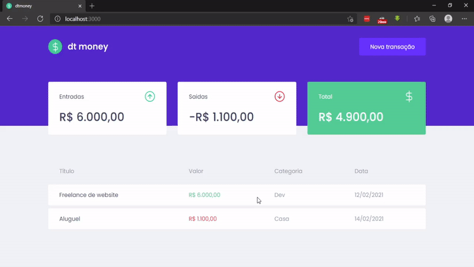

<h1 align="center">
  
</h1>
</p>

## Table of Contents
* [Introduction](#introduction)
* [Tecnologies](#tecnologies)
* [Features](#features)
* [How To Use](#how-to-use)


## Introduction

Keep control of your withdraws and deposits

## Tecnologies

* React
* Styled-components

## Features

A few of the things you can do with rocketshoes:

* Add your withdraws
* Add your deposits
* Visualize deposits total
* Visualize withdraws total
* Visualize total

<p align="center">
  
</p>

## How To Use

To clone and run this application, you'll need Git and Node.js (which comes with npm) installed on your computer. From your command line:
```bash
# Clone this repository
$ git clone https://github.com/ardotheedu/dt.money-ignite

# Go into the repository
$ cd dt.money-ignite   

# Install dependencies
$ yarn

# Run the app
$ yarn start
```
Open [http://localhost:3000](http://localhost:3000) with your browser to see the result.


